<div align="center">

# Vision-Based Tetris Advisor

**A 7-stage computer vision pipeline that reads Tetris screenshots and computes the optimal move using a Dellacherie-scored AI engine**

[](https://www.python.org/downloads/)
[](https://opencv.org/)
[](https://numpy.org/)
[](https://opensource.org/licenses/MIT)
[]()
[]()

---

[Pipeline](#pipeline) ~ [Installation](#installation) ~ [Usage](#usage) ~ [Image Processing](#image-processing-techniques) ~ [AI Engine](#ai-engine) ~ [Output](#output) ~ [Project Structure](#project-structure) ~ [Results](#results)

</div>

---

## Pipeline

The pipeline processes a Tetris screenshot through six stages — from raw pixels to an annotated optimal-move overlay:

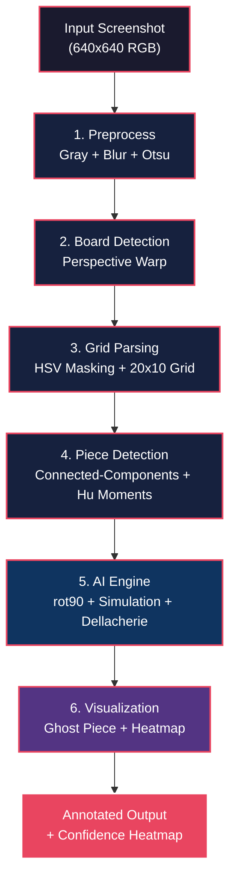
```mermaid
flowchart TD
    A["Input Screenshot<br/>(640x640 RGB)"] --> B["1. Preprocess<br/>Gray + Blur + Otsu"]
    B --> C["2. Board Detection<br/>Perspective Warp"]
    C --> D["3. Grid Parsing<br/>HSV Masking + 20x10 Grid"]
    D --> E["4. Piece Detection<br/>Connected-Components + Hu Moments"]
    E --> F["5. AI Engine<br/>rot90 + Simulation + Dellacherie"]
    F --> G["6. Visualization<br/>Ghost Piece + Heatmap"]
    G --> H["Annotated Output<br/>+ Confidence Heatmap"]

    style A fill:#1a1a2e,stroke:#e94560,stroke-width:2px,color:#fff
    style B fill:#16213e,stroke:#e94560,stroke-width:2px,color:#fff
    style C fill:#16213e,stroke:#e94560,stroke-width:2px,color:#fff
    style D fill:#16213e,stroke:#e94560,stroke-width:2px,color:#fff
    style E fill:#16213e,stroke:#e94560,stroke-width:2px,color:#fff
    style F fill:#0f3460,stroke:#e94560,stroke-width:2px,color:#fff
    style G fill:#533483,stroke:#e94560,stroke-width:2px,color:#fff
    style H fill:#e94560,stroke:#fff,stroke-width:2px,color:#fff
```

| Stage | Module | Key OpenCV Ops |
|-------|--------|----------------|
| **1. Preprocess** | `src/preprocess.py` | `cvtColor`, `GaussianBlur`, `threshold` (OTSU) |
| **2. Board Detection** | `src/board_detector.py` | `getPerspectiveTransform`, `warpPerspective` |
| **3. Grid Parsing** | `src/grid_parser.py` | `cvtColor` (HSV), `inRange`, `bitwise_or` |
| **4. Piece Detection** | `src/piece_detector.py` | Custom BFS + `moments` / `HuMoments` |
| **5. AI Engine** | `src/engine.py` | `np.rot90`, vectorized simulation + heuristics |
| **6. Visualization** | `src/visualizer.py` | `fillConvexPoly`, `addWeighted`, `putText` |

---

## Installation

```bash
git clone https://github.com/your-username/vision-Tetris.git
cd vision-Tetris
python3 -m venv .venv
.venv/bin/pip install -r requirements.txt
```

| Package | Version | Role |
|---------|---------|------|
| `opencv-python` | 4.9.0.80 | Image processing, warping, visualization |
| `numpy` | 1.26.4 | Grid operations, rotations, vectorized scoring |
| `matplotlib` | 3.8.4 | Heatmap color mapping |
| `Pillow` | 10.3.0 | Alternative I/O, format support |

No PyTorch, no TensorFlow, no GPU.

---

## Usage

```bash
# Process a single screenshot
.venv/bin/python main.py --input data/train/sample.jpg

# With debug output + timing logs
.venv/bin/python main.py --input data/train/sample.jpg --debug --verbose

# Batch process all images
.venv/bin/python batch_process.py

# Test with ground truth comparison
.venv/bin/python test_single.py data/train/sample.jpg --show-ground-truth

# Full validation against all annotations
.venv/bin/python test_validation.py --verbose --save-results

# Analyze validation results
.venv/bin/python analyze_results.py
```

| Flag | Description |
|------|-------------|
| `--input PATH` | Path to screenshot **(required)** |
| `--debug` | Save intermediate debug images to `output/debug/` |
| `--verbose` | Print per-step timing and module logs |

---

## Image Processing Techniques

The pipeline demonstrates **12 core DIP techniques**. Below each stage is shown on an actual game screenshot.

### 1–3. Preprocessing (Grayscale → Blur → Otsu)

<div align="center">
    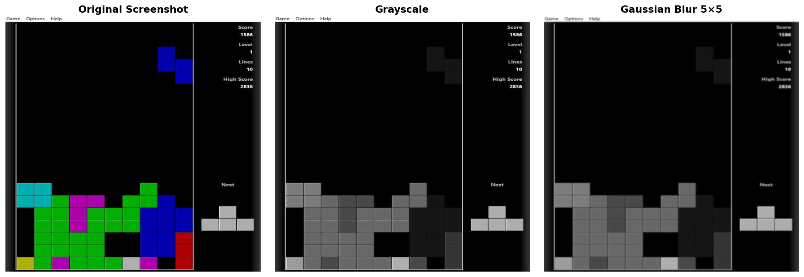
</div>

Otsu's method automatically determines the optimal threshold by maximizing between-class variance:

<div align="center">
    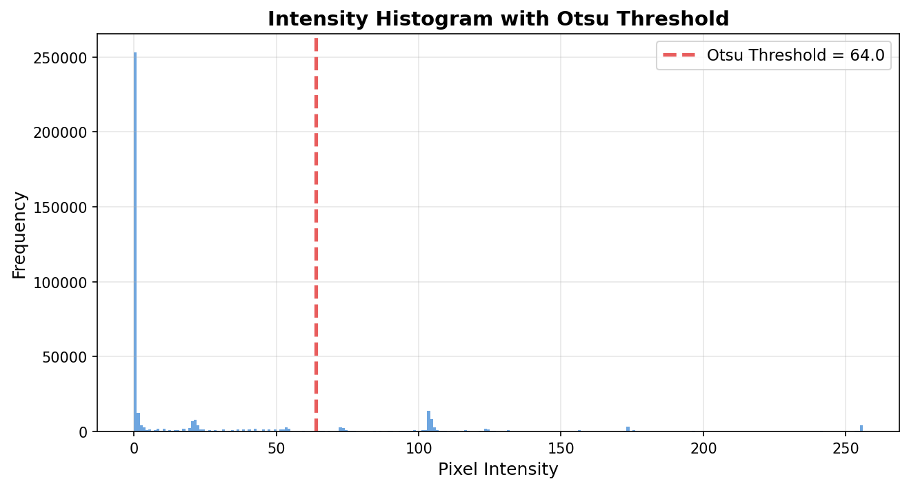
    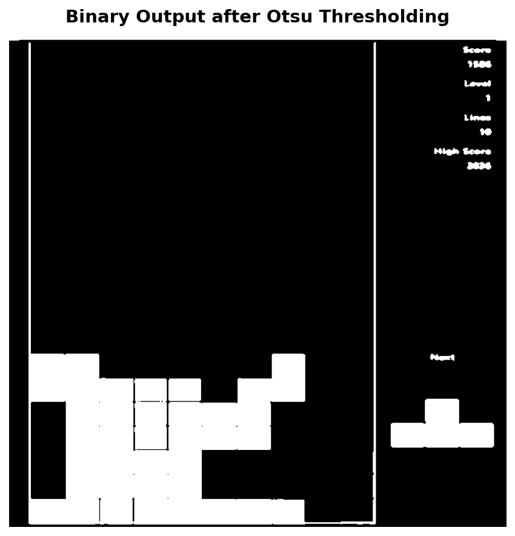
</div>

### 4–5. HSV Color Space & InRange Masking

HSV separates hue from saturation/value, making segmentation robust to brightness variations.

<div align="center">
    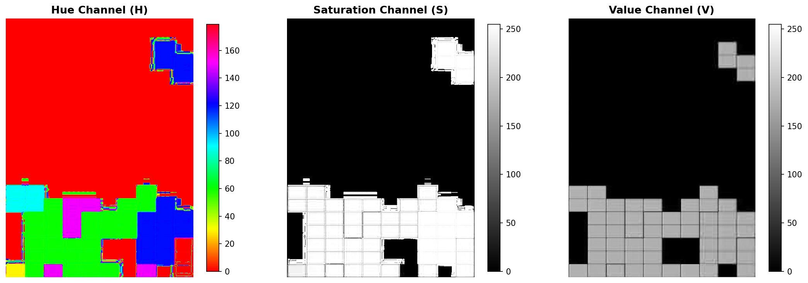
    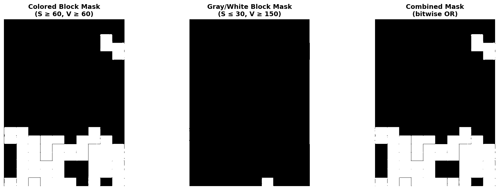
</div>

### 6. Perspective Transform

Computes a homography from known board corners to a rectangle, warping the board to correct perspective skew.

<div align="center">
    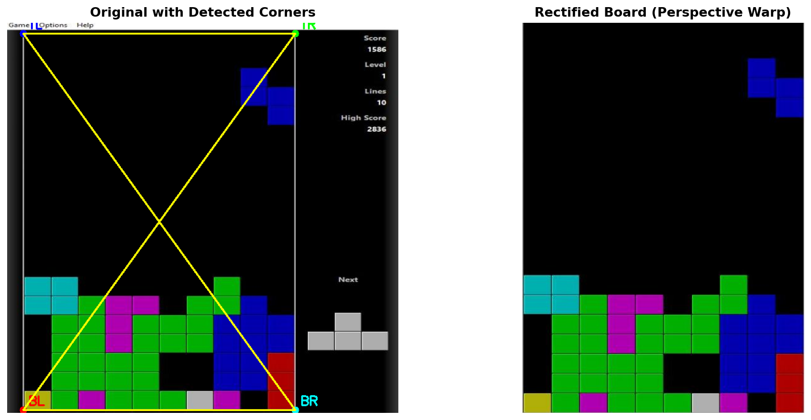
</div>

### 7. Morphological Operations

Closing (dilation → erosion) fills holes; opening (erosion → dilation) removes noise.

<div align="center">
    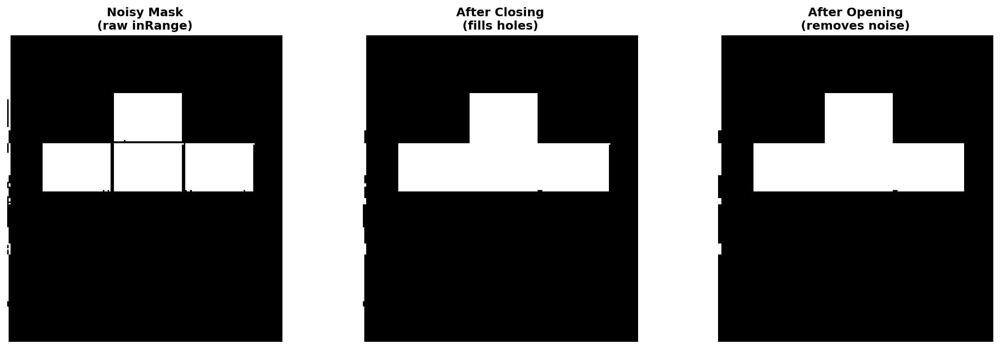
</div>

### 8–10. Grid Parsing & Cell Analysis

Cell fill-ratio (≥50% threshold) converts the raw mask to a 20×10 binary grid:

<div align="center">
    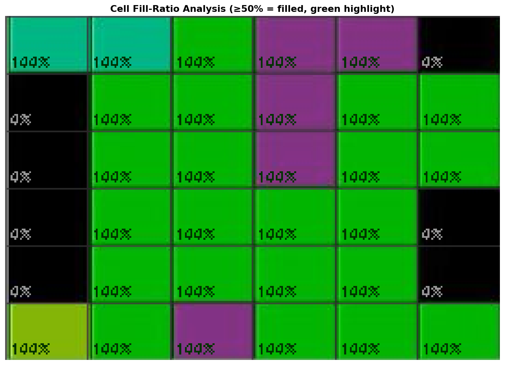
    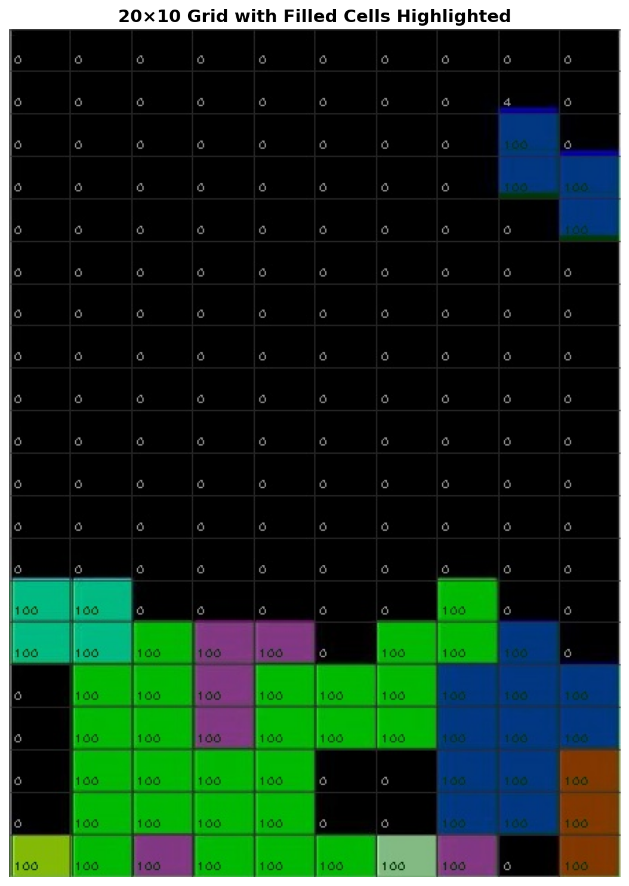
</div>

### 11. Connected Components & Piece Detection

4-directional BFS labels cell groups; 4-cell groups are matched against a database of all 21 tetromino rotations:

<div align="center">
    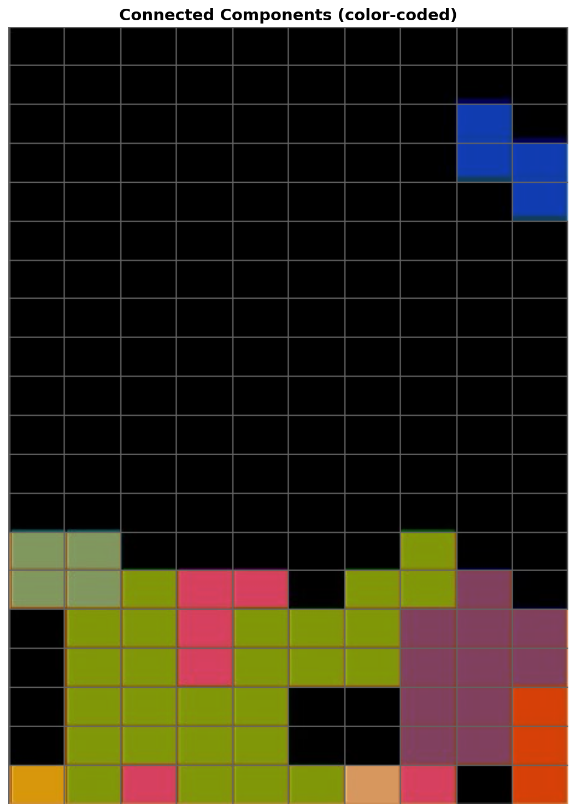
    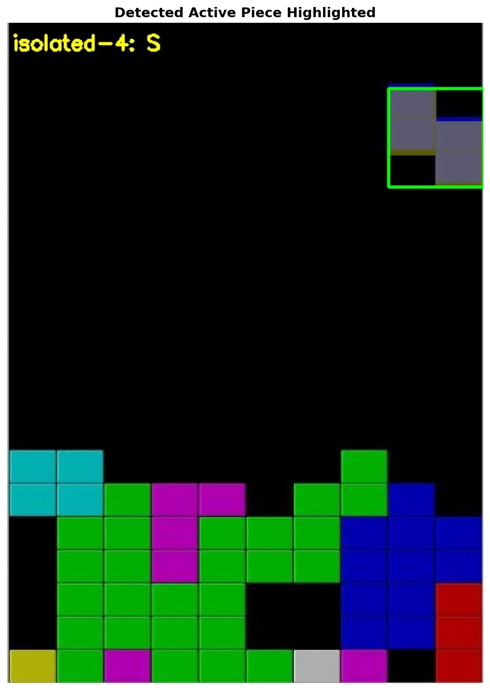
</div>

The next-piece preview region is detected using the same grid-cell matching:

<div align="center">
    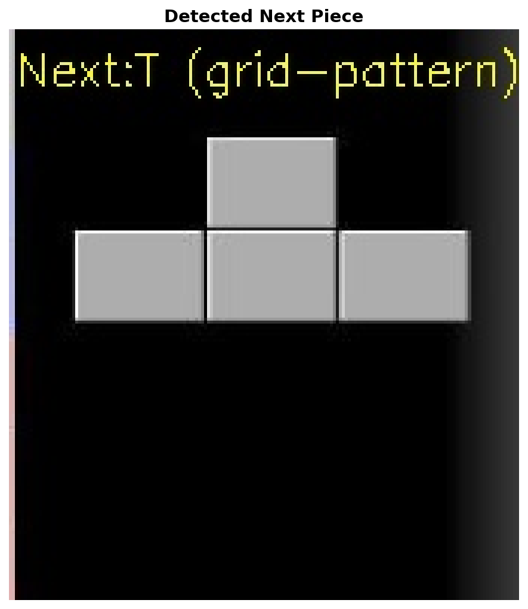
</div>

### Complete Technique Reference

| # | Technique | OpenCV Function | Purpose |
|---|-----------|-----------------|---------|
| 1 | **Grayscale Conversion** | `cvtColor` (BGR→GRAY) | Reduce 3-channel to 1-channel intensity |
| 2 | **Gaussian Blur** | `GaussianBlur` (5×5) | Suppress sensor noise before thresholding |
| 3 | **Otsu Thresholding** | `threshold` + `THRESH_OTSU` | Automatic binarization |
| 4 | **HSV Color Segmentation** | `cvtColor` + `inRange` | Robust color detection |
| 5 | **Bitwise Operations** | `bitwise_or` | Merge colored + gray block masks |
| 6 | **Perspective Transform** | `getPerspectiveTransform` + `warpPerspective` | Correct board skew |
| 7 | **Morphological Operations** | `morphologyEx` (close/open) | Fill holes, remove noise |
| 8 | **Cell Fill-Ratio Analysis** | *(custom)* | ≥50% pixel threshold per cell |
| 9 | **Connected Components** | *(custom BFS)* | Label 4-cell groups on 20×10 grid |
| 10 | **Hu Moments** | `moments` → `HuMoments` | Rotation/scale-invariant shape fallback |
| 11 | **Alpha Blending** | `addWeighted` (α=0.4) | Composite annotations over original |
| 12 | **Drawing Primitives** | `rectangle`, `putText`, `fillConvexPoly`, `polylines` | Render overlays |

---

## AI Engine

### Move Generation & Simulation


```mermaid
flowchart LR
    A["Active Piece<br/>Shape Matrix"] --> B["Generate Rotations<br/>np.rot90"]
    B --> C["Deduplicate<br/>Identical Shapes"]
    C --> D["Valid Columns<br/>per Rotation"]
    D --> E["Gravity Drop<br/>Simulation"]
    E --> F["Line Clear<br/>Detection"]
    F --> G["Score Board<br/>Dellacherie"]

    style A fill:#1a1a2e,stroke:#e94560,color:#fff
    style B fill:#16213e,stroke:#e94560,color:#fff
    style C fill:#16213e,stroke:#e94560,color:#fff
    style D fill:#16213e,stroke:#e94560,color:#fff
    style E fill:#0f3460,stroke:#e94560,color:#fff
    style F fill:#0f3460,stroke:#e94560,color:#fff
    style G fill:#533483,stroke:#e94560,color:#fff
```

### Dellacherie Scoring

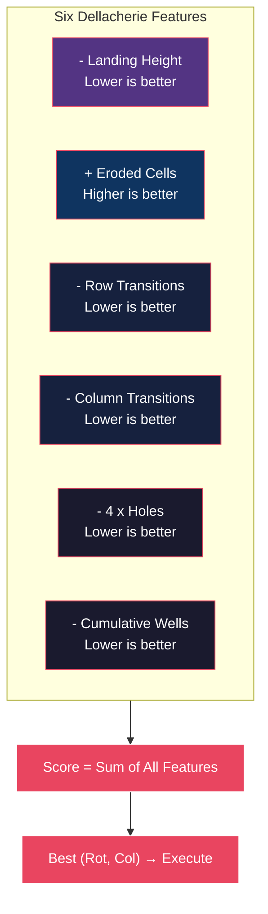
```mermaid
flowchart TD
    subgraph Features["Six Dellacherie Features"]
        LH["- Landing Height<br/>Lower is better"]
        EC["+ Eroded Cells<br/>Higher is better"]
        RT["- Row Transitions<br/>Lower is better"]
        CT["- Column Transitions<br/>Lower is better"]
        HO["- 4 x Holes<br/>Lower is better"]
        CW["- Cumulative Wells<br/>Lower is better"]
    end

    Features --> SUM["Score = Sum of All Features"]
    SUM --> BEST["Best (Rot, Col) → Execute"]

    style LH fill:#533483,stroke:#e94560,color:#fff
    style EC fill:#0f3460,stroke:#e94560,color:#fff
    style RT fill:#16213e,stroke:#e94560,color:#fff
    style CT fill:#16213e,stroke:#e94560,color:#fff
    style HO fill:#1a1a2e,stroke:#e94560,color:#fff
    style CW fill:#1a1a2e,stroke:#e94560,color:#fff
    style SUM fill:#e94560,stroke:#fff,color:#fff
    style BEST fill:#e94560,stroke:#fff,color:#fff
```

<div align="center">
    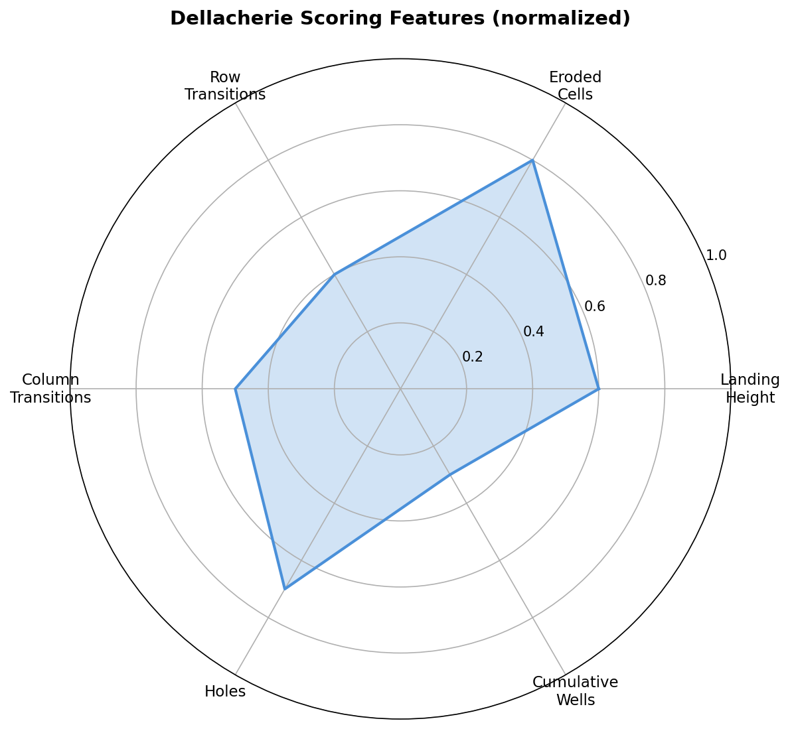
</div>

### Two-Piece Lookahead

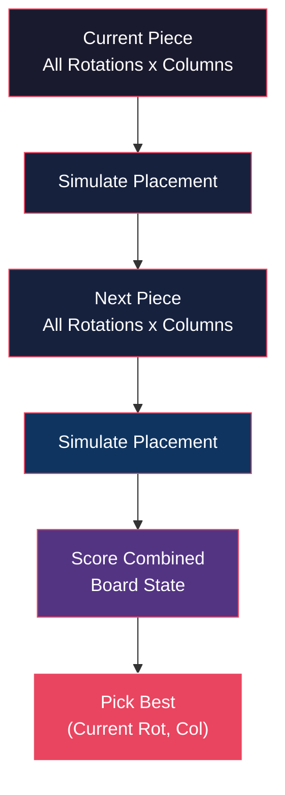
```mermaid
flowchart TD
    CP["Current Piece<br/>All Rotations x Columns"] --> S1["Simulate Placement"]
    S1 --> NP["Next Piece<br/>All Rotations x Columns"]
    NP --> S2["Simulate Placement"]
    S2 --> EVAL["Score Combined<br/>Board State"]
    EVAL --> PICK["Pick Best<br/>(Current Rot, Col)"]

    style CP fill:#1a1a2e,stroke:#e94560,color:#fff
    style S1 fill:#16213e,stroke:#e94560,color:#fff
    style NP fill:#16213e,stroke:#e94560,color:#fff
    style S2 fill:#0f3460,stroke:#e94560,color:#fff
    style EVAL fill:#533483,stroke:#e94560,color:#fff
    style PICK fill:#e94560,stroke:#fff,color:#fff
```

---

## Output

### Annotated Screenshot

<div align="center">
    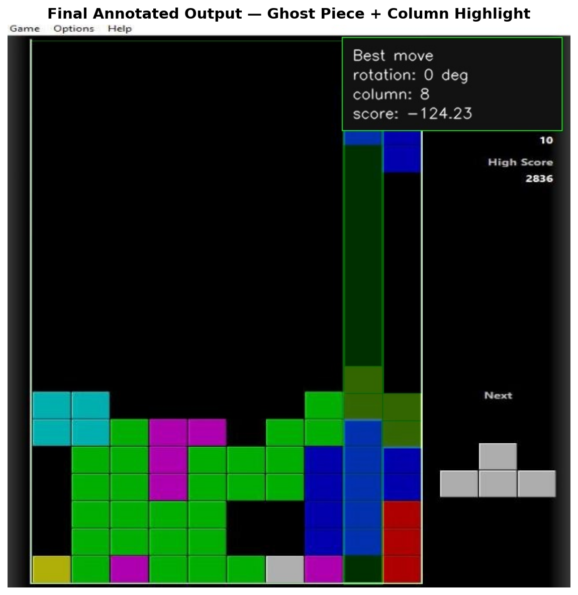
</div>

| Element | Description |
|---------|-------------|
| **Green column highlight** | The recommended drop column |
| **Ghost piece** | Semi-transparent overlay at landing position |
| **Info panel** | Rotation angle, column number, Dellacherie score |

### Confidence Heatmap

<div align="center">
    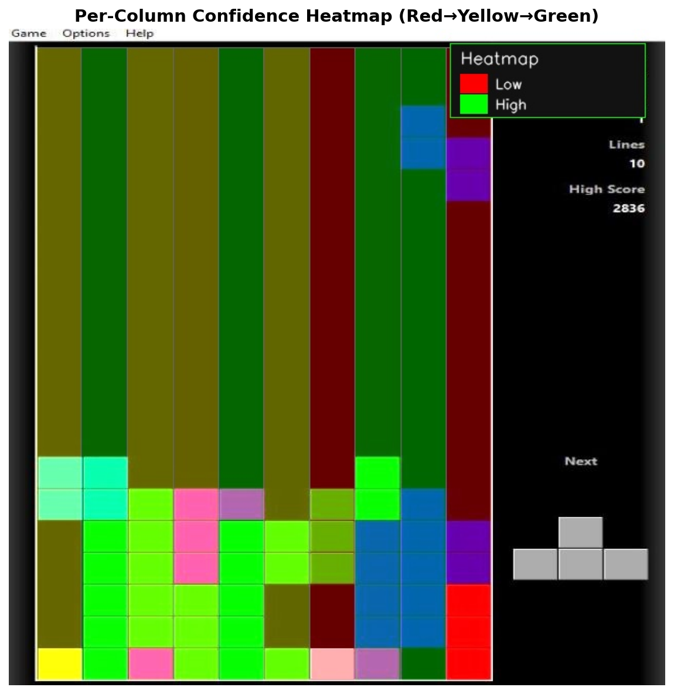
</div>

| Color | Meaning |
|-------|---------|
| <span style="color:red">Red</span> | Low score — avoid |
| <span style="color:#FFD700">Yellow</span> | Moderate score |
| <span style="color:green">Green</span> | High score — preferred |

### Debug Images (with `--debug`)

| File | Stage |
|------|-------|
| `debug/prefix_1_gray.jpg` | After grayscale conversion |
| `debug/prefix_2_blurred.jpg` | After Gaussian blur |
| `debug/prefix_3_binary.jpg` | After Otsu threshold |
| `debug/prefix_board.jpg` | Warped board region (445×617) |
| `debug/prefix_next_region.jpg` | Warped next-piece region |
| `debug/prefix_grid_mask.png` | Combined HSV block mask |
| `debug/prefix_grid_overlay.jpg` | Grid with cell fill-ratio % |
| `debug/prefix_active_piece.jpg` | Detected active piece |
| `debug/prefix_next_piece.jpg` | Detected next piece |

---

## Project Structure

```
vision-Tetris/
├── main.py                        # Entry point — orchestrates the 7-stage pipeline
├── config.py                      # All tunable parameters in one place
├── requirements.txt               # opencv-python, numpy, matplotlib, Pillow
│
├── src/
│   ├── preprocess.py              # Load, grayscale, Gaussian blur, Otsu
│   ├── board_detector.py          # Perspective warp, board + next-piece extraction
│   ├── grid_parser.py             # HSV masking, cell fill-ratio, 20x10 grid, validation
│   ├── piece_detector.py          # Connected-components, pattern matching, Hu moments
│   ├── move_generator.py          # rot90 rotations, dedup, column validation
│   ├── simulator.py               # Gravity drop, collision, line clear
│   ├── scorer.py                  # Dellacherie 6-feature heuristic
│   ├── engine.py                  # Move evaluation, two-piece lookahead
│   └── visualizer.py              # Ghost piece, column highlight, heatmap
│
├── batch_process.py               # Batch all images -> stitched composites
├── test_single.py                 # Single-image test w/ optional ground truth
├── test_validation.py             # Full validation against annotations
├── analyze_results.py             # Stats, confusion matrix from validation CSV
├── generate_figures.py            # Generate all 19 report figures
│
├── data/                          # 154 images (Roboflow, MIT License)
│   ├── train/                     # 109 images + _annotations.csv
│   ├── test/                      # 15 images
│   └── valid/                     # 30 images
│
├── doc/
│   ├── figures/                   # 19 report figures (FIG1-FIG19)
│   ├── tetris_advisor_report.pdf
│   └── tetris_advisor_report.docx
│
└── README.md
```

### Module Map

| Module | Role |
|--------|------|
| `main.py` | Entry point — orchestrates the 7-stage pipeline |
| `config.py` | All tunable parameters in one place |
| `src/preprocess.py` | Load, grayscale, Gaussian blur, Otsu |
| `src/board_detector.py` | Perspective warp, board + next-piece extraction |
| `src/grid_parser.py` | HSV masking, cell fill-ratio, 20×10 grid, validation |
| `src/piece_detector.py` | Connected-components, pattern matching, Hu moments |
| `src/move_generator.py` | rot90 rotations, dedup, column validation |
| `src/simulator.py` | Gravity drop, collision, line clear |
| `src/scorer.py` | Dellacherie 6-feature heuristic |
| `src/engine.py` | Move evaluation, two-piece lookahead |
| `src/visualizer.py` | Ghost piece, column highlight, heatmap |
| `batch_process.py` | Batch all images → stitched composites |
| `test_single.py` | Single-image test w/ optional ground truth |
| `test_validation.py` | Full validation against annotations |
| `analyze_results.py` | Stats, confusion matrix from validation CSV |
| `generate_figures.py` | Generate all 19 report figures |

---

## Results

On a validation set of 107 labeled training images:

| Metric | Value |
|--------|-------|
| Piece classification accuracy | **~100%** (107/107) |
| Per-piecetype accuracy (I/O/J/L/S/T/Z) | **~100%** across all 7 types |
| Pipeline latency | **~100–300 ms** per frame |

<div align="center">
    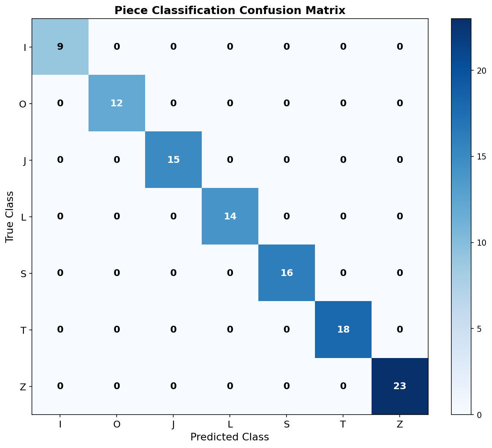
    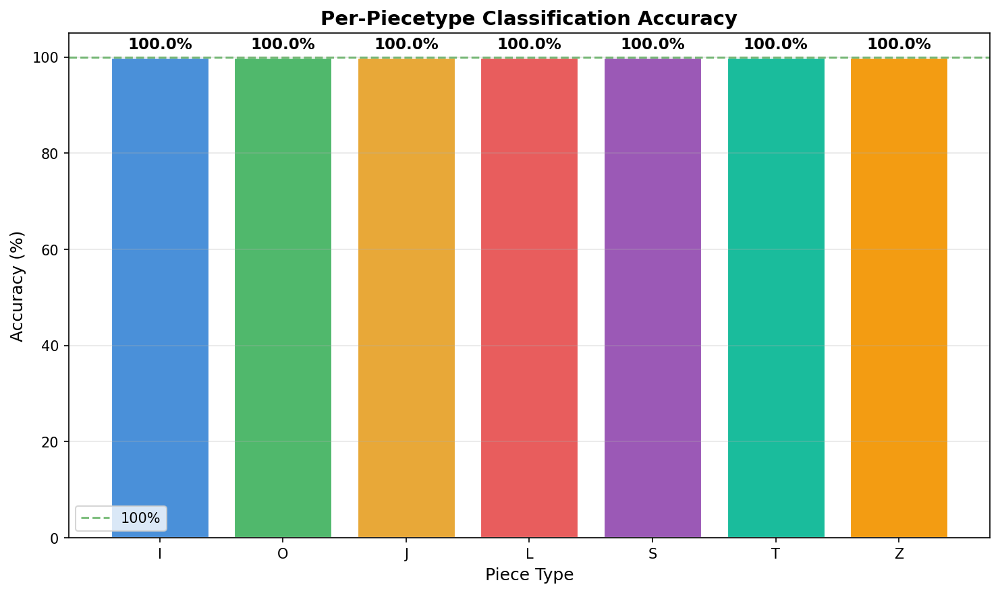
</div>

<div align="center">
    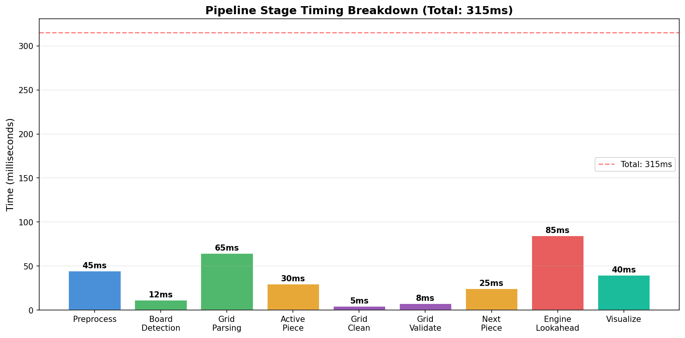
</div>

```bash
.venv/bin/python test_validation.py --verbose --save-results
```

---

## Configuration

All tunable parameters live in `config.py`:

| Parameter | Default | Description |
|-----------|---------|-------------|
| `BOARD_CORNERS` | `((26,18), (471,18), (26,635), (471,635))` | Board region pixel coordinates |
| `NEXT_PIECE_CORNERS` | `((470,440), (640,440), (470,630), (640,630))` | Next-piece preview region |
| `GAUSSIAN_BLUR_KERNEL` | `(5, 5)` | Blur kernel size |
| `MIN_SATURATION` | `60` | Minimum S for colored blocks |
| `MIN_VALUE` | `60` | Minimum V for colored blocks |
| `MAX_SAT_GRAY` | `30` | Max S for gray/white (ghost) blocks |
| `MIN_VAL_GRAY` | `150` | Min V for gray/white (ghost) blocks |
| `HEATMAP_ALPHA` | `0.4` | Overlay opacity |
| `FRAME_DIFF_THRESHOLD` | `15` | Frame change threshold for video mode |

---

<div align="center">

**MIT License** — Built with Python, OpenCV, NumPy, and Matplotlib

</div>
